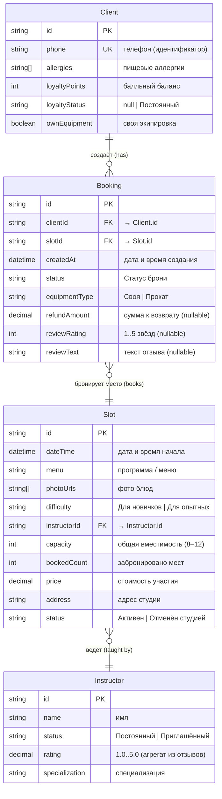
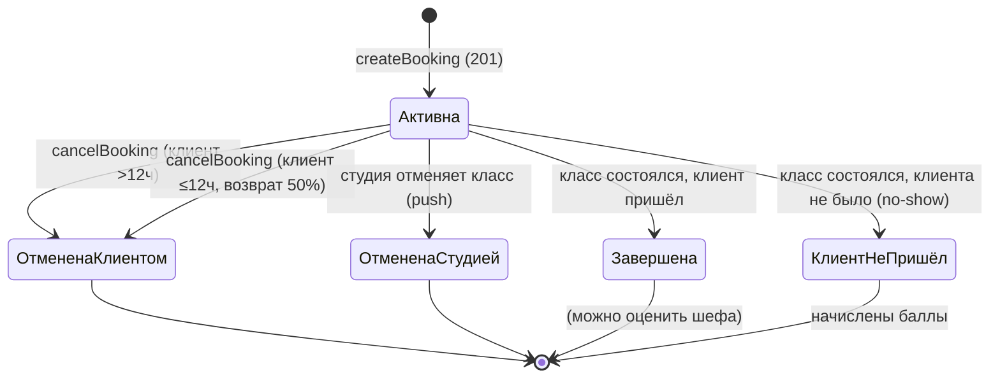

# Модель данных (ER-модель) — «Шеф-стол»

> Построена на основе domain-description.md и функциональных требований.  
> Описывает логическую модель: сущности, атрибуты, связи, кардинальность.  
> Для каждой сущности помечено: что приложение **только читает** (источник истины — бэкенд), а что **меняет** (создаёт / редактирует через API).

---

## 1. ER-диаграмма

---

## 2. Описание сущностей

### Условные обозначения

| Метка | Значение |
|-------|----------|
| 👁 R | Приложение **только читает** (данные приходят из бэкенда) |
| ✏️ W | Приложение **меняет** (создаёт / редактирует через API, бэкенд — источник истины) |

---

### 2.1. Client (Клиент)

Конечный пользователь мобильного приложения. Идентифицируется по номеру телефона.

| Атрибут | Тип | Доступ | Описание |
|---------|-----|--------|----------|
| `id` | string (UUID) | 👁 R | Уникальный идентификатор, назначается бэкендом |
| `phone` | string | 👁 R | Номер телефона — первичный идентификатор для регистрации/входа (SMS) |
| `allergies` | string[] | ✏️ W | Список пищевых ограничений. Клиент задаёт один раз в профиле, может редактировать |
| `loyaltyPoints` | int | 👁 R | Балльный баланс — начисляется бэкендом (no-show, программа лояльности). Приложение только отображает |
| `loyaltyStatus` | string? | 👁 R | `"Постоянный"` при 3+ посещённых классах за 2 месяца, иначе `null`. Вычисляется бэкендом |
| `ownEquipment` | boolean | ✏️ W | `true` — клиент приходит со своей экипировкой; `false` — берёт прокат. Редактируется в профиле |

**Правила:**
- Регистрация — только по SMS-коду на номер телефона.
- Баллы и статус лояльности назначаются бэкендом — приложение считывает, но не модифицирует.
- Список аллергий подтягивается в форму бронирования автоматически.

---

### 2.2. Instructor (Шеф)

Сотрудник студии, ведущий мастер-классы. **Полностью read-only** для клиентского приложения.

| Атрибут | Тип | Доступ | Описание |
|---------|-----|--------|----------|
| `id` | string (UUID) | 👁 R | Уникальный идентификатор |
| `name` | string | 👁 R | Имя шефа — отображается в карточке класса и списке броней |
| `status` | string | 👁 R | `"Постоянный"` (5 чел.) или `"Приглашённый"` (сезонно) |
| `rating` | decimal | 👁 R | Средняя оценка 1.0–5.0, агрегируется бэкендом из отзывов клиентов |
| `specialization` | string? | 👁 R | Специализация шефа (опционально, подразумевается через ведомые программы) |

**Правила:**
- Управление шефами — вне скоупа мобильного приложения (админка / существующая инфраструктура).
- Рейтинг отображается в карточке класса **до записи** и пересчитывается бэкендом.

---

### 2.3. Slot (Класс / Слот)

Одно событие в расписании студии. **Полностью read-only** для клиентского приложения.

| Атрибут | Тип | Доступ | Описание |
|---------|-----|--------|----------|
| `id` | string (UUID) | 👁 R | Уникальный идентификатор слота |
| `dateTime` | datetime | 👁 R | Дата и время начала (длительность ~3 часа подразумевается) |
| `menu` | string | 👁 R | Название программы / меню (например «Итальянская паста») |
| `photoUrls` | string[] | 👁 R | Ссылки на фотографии блюд |
| `difficulty` | string | 👁 R | `"Для новичков"` или `"Для опытных"` |
| `instructorId` | string (FK) | 👁 R | Ссылка на Instructor.id — шеф, ведущий класс |
| `capacity` | int | 👁 R | Общая вместимость: до 12 мест, до 8 — для классов с духовками |
| `bookedCount` | int | 👁 R | Количество уже забронированных мест. Свободных мест = `capacity − bookedCount` |
| `price` | decimal | 👁 R | Стоимость участия |
| `address` | string | 👁 R | Адрес студии (лофт на территории бывшего завода) |
| `status` | string | 👁 R | `"Активен"` — класс состоится; `"Отменён студией"` — форс-мажор |

**Правила:**
- Расписание формируется бэкендом на 7 дней вперёд.
- Фильтрация в приложении — **только по дате**.
- Запись возможна не позднее чем за 10 минут до начала.
- Если `status = "Отменён студией"` — повторная запись на этот слот запрещена.
- Точное число свободных мест = `capacity − bookedCount`, отображается как «Осталось N из M».

---

### 2.4. Booking (Бронь)

Связь клиента со слотом. **Клиентское приложение создаёт, отменяет, переносит** — бэкенд выполняет атомарные проверки и является источником истины.

| Атрибут | Тип | Доступ | Описание |
|---------|-----|--------|----------|
| `id` | string (UUID) | 👁 R | Уникальный идентификатор, назначается бэкендом при создании |
| `clientId` | string (FK) | 👁 R | Ссылка на Client.id |
| `slotId` | string (FK) | 👁 R | Ссылка на Slot.id |
| `createdAt` | datetime | 👁 R | Дата и время создания брони (ставит бэкенд) |
| `status` | string | 👁 R¹ | Текущий статус брони (см. диаграмму состояний ниже) |
| `equipmentType` | string | ✏️ W | `"Своя"` — клиент со своей экипировкой; `"Прокат"` — единый набор (фартук + ножи, бесплатно) |
| `refundAmount` | decimal? | 👁 R | Сумма к возврату при отмене ≤12 ч до начала (50%). Фиксируется бэкендом. Приложение только отображает |
| `reviewRating` | int? | ✏️ W | Оценка шефу 1–5 звёзд. Можно редактировать в любой момент |
| `reviewText` | string? | ✏️ W | Текстовый отзыв (опционально). Можно редактировать в любой момент |

> ¹ Статус меняется бэкендом, но инициатором части переходов является клиентское приложение (отмена, перенос).

**Диаграмма состояний брони (статусная модель):**

**Правила:**
- Бэкенд гарантирует «0 двойных броней» — атомарная проверка `bookedCount < capacity` при создании.
- Отмена клиентом: `>12ч` до начала — возврат 100% (бесплатно); `≤12ч` — возврат 50%, фиксируется `refundAmount`.
- Перенос брони: бэкенд выполняет одной транзакцией (отмена старой + создание новой).
- No-show: после начала класса неявившиеся брони получают статус `"Клиент не пришёл"`, начисляются баллы.
- Оценку шефа (`reviewRating`, `reviewText`) можно выставить после `"Завершена"` и редактировать в любой момент.

---

## 3. Сводка связей

| Связь | Тип | Кардинальность | Описание |
|-------|-----|----------------|----------|
| Client → Booking | has | 1 : 0..* | У клиента может не быть броней; верхняя граница не ограничена |
| Booking → Slot | books | * : 1 | Каждая бронь — ровно на один слот. На слот может быть много броней (до capacity) |
| Slot → Instructor | taught by | * : 1 | Каждый слот ведёт ровно один шеф. Шеф может вести много слотов |
| Booking → Review | contains | 1 : 0..1 | Бронь может содержать оценку (0 или 1). Оценка не существует отдельно от брони |

---

## 4. Сводка по доступу (Read / Write)

| Сущность | 👁 Read (приложение читает) | ✏️ Write (приложение меняет) | Комментарий |
|----------|---------------------------|------------------------------|-------------|
| **Client** | ✅ профиль, баллы, статус лояльности | ✅ `allergies`, `ownEquipment` | Баллы и статус лояльности — только чтение (вычисляет бэкенд) |
| **Instructor** | ✅ полностью | ❌ | Управление — админка (вне скоупа) |
| **Slot** | ✅ полностью | ❌ | Расписание и статусы — бэкенд |
| **Booking** | ✅ история, статусы, refundAmount | ✅ создание, отмена, перенос; `equipmentType`, `reviewRating`, `reviewText` | Статус меняет бэкенд, операции инициирует приложение |
