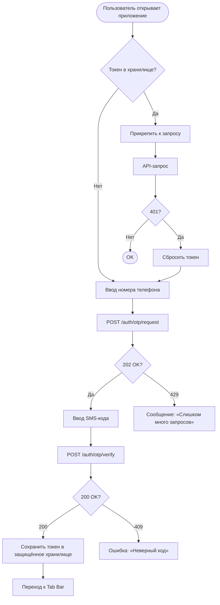

# OTP-авторизация

**ID:** LOGIC-001  
**Тип:** Логика  
**Домен:** 09. Логики  
**Приоритет:** Critical  
**Статус:** Черновик  
**Функциональные блоки:** —  

---

## История изменений

| Релиз | ТЗ | Описание изменений |
|-------|-----|-------------------|
| — | — | Первоначальная документация |

---

## Входные данные

| Название | Тип | Возможные значения | Описание |
|----------|-----|-------------------|----------|
| `phone` | Кэш / Состояние | `+7 XXX XXX-XX-XX` | Номер телефона, введённый пользователем |
| `auth_token` | Защищённое хранилище | JWT Bearer token | Сохраняется после `verifyOtp`, используется во всех авторизованных запросах |

---

## Обзор

Клиент вводит номер телефона → бэкенд отправляет SMS-код → клиент вводит код → бэкенд проверяет и возвращает Bearer-токен. Токен сохраняется в защищённом хранилище и прикрепляется ко всем последующим API-запросам в заголовке `Authorization: Bearer {token}`. При получении 401 от любого endpoint — сброс токена и редирект на экран авторизации (SCR-006) с сообщением «Сессия истекла, войдите снова».

### User Story

> Как Клиент, я хочу авторизоваться в приложении по номеру телефона через SMS,
> чтобы войти в личный кабинет без необходимости придумывать и запоминать пароль.

### Бизнес-ценность

- Безбарьерный вход — не нужно запоминать пароль
- Номер телефона — первичный идентификатор клиента (data-model §2.1)
- Без авторизации приложение не функционирует (все domain API требуют Bearer-токен)

---

## Точки применения

| Экран/Компонент | Элемент/Триггер | Условие |
|-----------------|-----------------|---------|
| [SCR-006](../SCR-006_Auth.md) | Экран целиком | При запуске без валидного токена |
| Любой экран | Перехват 401 | Токен истёк / невалиден |

---

## Флоу

---

## Описание логики

### Шаг 1: Запрос SMS-кода

Пользователь вводит номер телефона. Приложение вызывает `requestOtp` с телом `{ phone }`. Бэкенд отправляет SMS с кодом и возвращает 202. При 429 (rate limit) — сообщение «Слишком много запросов. Повторите позже.»

### Шаг 2: Проверка кода

Пользователь вводит полученный SMS-код. Приложение вызывает `verifyOtp` с телом `{ phone, code }`. При 200 бэкенд возвращает `{ token, expiresIn }`. При 409 (неверный код) — сообщение «Неверный код подтверждения.»

### Шаг 3: Хранение токена

Токен сохраняется в защищённое хранилище (Android EncryptedSharedPreferences / Keystore). Время жизни токена (`expiresIn`) сохраняется для превентивной проверки срока.

### Шаг 4: Прикрепление к запросам

Все авторизованные запросы отправляются с заголовком `Authorization: Bearer {token}`.

### Шаг 5: Обработка 401

При получении 401 от любого endpoint:
1. Сбросить токен из хранилища.
2. Показать сообщение «Сессия истекла, войдите снова».
3. Редирект на SCR-006_Auth.

---

## API запросы

### POST /auth/otp/request

**Триггер:** пользователь нажимает «Получить код»

**Параметры/Body:**

| Параметр | Тип | Описание | Значение/Источник |
|----------|-----|----------|-------------------|
| `phone` | string | Номер телефона | Ввод пользователя |

**Обработка ответа:**

| Результат | Действие |
|-----------|----------|
| Загрузка | Лоадер на кнопке |
| Успех (202) | Показать поле ввода кода, запустить таймер повторной отправки |
| Ошибка 429 | Снек «Слишком много запросов. Повторите позже.» |
| Ошибка 5xx | Снек «Произошла ошибка. Попробуйте позже» |
| Ошибка сети | Снек «Нет соединения. Проверьте подключение» |

### POST /auth/otp/verify

**Триггер:** пользователь нажимает «Войти» после ввода кода

**Параметры/Body:**

| Параметр | Тип | Описание | Значение/Источник |
|----------|-----|----------|-------------------|
| `phone` | string | Номер телефона | Сохранён из шага 1 |
| `code` | string | SMS-код | Ввод пользователя |

**Обработка ответа:**

| Результат | Действие |
|-----------|----------|
| Загрузка | Лоадер на кнопке |
| Успех (200) | Сохранить `token`, переход к Tab Bar |
| Ошибка 409 | Снек «Неверный код подтверждения.» |
| Ошибка 5xx | Снек «Произошла ошибка. Попробуйте позже» |
| Ошибка сети | Снек «Нет соединения. Проверьте подключение» |

---

## Локальное хранение

| Ключ | Тип хранения | Описание |
|------|--------------|----------|
| `auth_token` | Защищённое хранилище (EncryptedSharedPreferences) | Bearer-токен JWT |
| `token_expires_at` | Защищённое хранилище | Unix timestamp истечения токена |

---

## Связанные требования

### Функциональные (FR-*)

| ID | Название | Приоритет |
|----|----------|-----------|
| FR-2.1 | Регистрация и авторизация клиентов только по номеру телефона с подтверждением через SMS | High |

### Нефункциональные (NFR-*)

| ID | Название | Приоритет |
|----|----------|-----------|
| NFR-5 | Обмен данными по канонической схеме API | High |

---

## Критерии приёмки

| ID | Критерий |
|----|----------|
| AC-001 | **Дано** пользователь без токена, **Когда** открывает приложение, **Тогда** видит экран авторизации с полем ввода телефона |
| AC-002 | **Дано** введён корректный номер телефона, **Когда** нажимает «Получить код», **Тогда** появляется поле ввода SMS-кода |
| AC-003 | **Дано** введён верный SMS-код, **Когда** нажимает «Войти», **Тогда** токен сохраняется, переход к Tab Bar |
| AC-004 | **Дано** введён неверный SMS-код, **Когда** нажимает «Войти», **Тогда** сообщение «Неверный код подтверждения» |
| AC-005 | **Дано** любой API-запрос, **Когда** бэкенд возвращает 401, **Тогда** токен сбрасывается, редирект на SCR-006 с сообщением «Сессия истекла» |

---

## Обработка ошибок

| Тип ошибки | Контекст | Действие |
|------------|----------|----------|
| 401 Unauthorized | Любой авторизованный запрос | Сброс токена, редирект на SCR-006 |
| 409 Conflict (invalid_code) | verifyOtp | Сообщение «Неверный код подтверждения» |
| 429 Too Many Requests | requestOtp | Сообщение «Слишком много запросов. Повторите позже.» |
