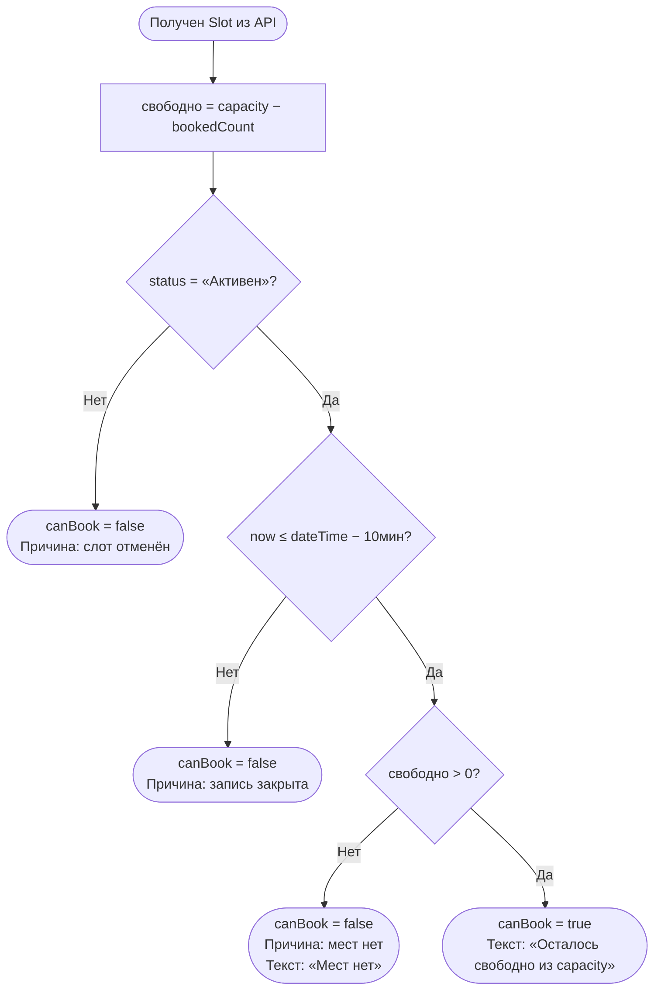

# Расчёт доступности

**ID:** LOGIC-002  
**Тип:** Логика  
**Домен:** 09. Логики  
**Приоритет:** Critical  
**Статус:** Черновик  
**Функциональные блоки:** —  

---

## История изменений

| Релиз | ТЗ | Описание изменений |
|-------|-----|-------------------|
| — | — | Первоначальная документация |

---

## Входные данные

| Название | Тип | Возможные значения | Описание |
|----------|-----|-------------------|----------|
| `slot` | Ответ API (`GET /slots/{slotId}`) | Объект Slot | Содержит `capacity`, `bookedCount`, `status`, `dateTime` |

---

## Обзор

Клиентский pre-check доступности слота для бронирования. Определяет: сколько свободных мест и можно ли забронировать слот прямо сейчас. Финальное решение — за бэкендом (атомарная проверка в `createBooking`). Pre-check — UX-помощник, блокирующий кнопку записи при очевидной недоступности.

### User Story

> Как Клиент, я хочу видеть точное количество свободных мест и понимать, могу ли я записаться,
> чтобы не тратить время на заполнение формы, если мест нет или запись закрыта.

### Бизнес-ценность

- Предотвращение фрустрации: кнопка «Записаться» неактивна, если запись невозможна
- Уменьшение числа 409/410-ответов от бэкенда
- Точное отображение свободных мест: «Осталось N из M» (FR-1.4)

---

## Точки применения

| Экран/Компонент | Элемент/Триггер | Условие |
|-----------------|-----------------|---------|
| [SCR-001](../SCR-001_Schedule.md) | Карточка класса в списке | При загрузке расписания |
| [SCR-002](../SCR-002_ClassDetail.md) | Кнопка «Записаться» | При открытии деталей класса |
| [SCR-003](../SCR-003_BookingForm.md) | Кнопка «Подтвердить запись» | Pre-check перед отправкой `createBooking` |
| [BS-002](../BS-002_TransferSelect.md) | Карточка слота в списке переноса | Исключает недоступные слоты |

---

## Флоу



---

## Описание логики

### Формула

```
свободно = slot.capacity − slot.bookedCount
canBook = (slot.status == "Активен") AND (now() ≤ slot.dateTime − 10 минут) AND (свободно > 0)
```

### Правила

1. **Статус:** если `slot.status == "Отменён студией"` — запись невозможна, кнопка неактивна, текст: «Класс отменён».
2. **Временное окно:** запись блокируется за 10 минут до начала. Если `now > dateTime - 10min` — кнопка неактивна, текст: «Запись закрыта».
3. **Свободные места:** если `bookedCount >= capacity` — кнопка неактивна, текст: «Мест нет».
4. **Pre-check не гарантирует:** между загрузкой `slot` и отправкой `createBooking` состояние могло измениться. Приложение доверяет финальному ответу бэкенда и обрабатывает 409/410.

### Отображение

- При `canBook = true`: «Осталось {свободно} из {capacity}», кнопка «Записаться» активна.
- При `canBook = false`:
  - Слот отменён: «Класс отменён студией»
  - Запись закрыта: «Запись закрыта»
  - Мест нет: «Мест нет»

---

## Критерии приёмки

| ID | Критерий |
|----|----------|
| AC-001 | **Дано** слот с `capacity=10, bookedCount=7, status="Активен", dateTime=+2ч`, **Когда** загружается карточка, **Тогда** текст «Осталось 3 из 10», кнопка «Записаться» активна |
| AC-002 | **Дано** слот с `bookedCount=capacity`, **Когда** загружается, **Тогда** текст «Мест нет», кнопка неактивна |
| AC-003 | **Дано** слот с `status="Отменён студией"`, **Когда** загружается, **Тогда** текст «Класс отменён студией», кнопка неактивна |
| AC-004 | **Дано** слот с `dateTime` через 5 минут, **Когда** загружается, **Тогда** текст «Запись закрыта», кнопка неактивна |

---

## Обработка ошибок

| Тип ошибки | Контекст | Действие |
|------------|----------|----------|
| 409 slot_full | Ответ createBooking | Pre-check пропустил. Обновить `bookedCount` через `GET /slots/{slotId}`, показать «Мест нет» |
| 410 slot_cancelled | Ответ createBooking | Обновить `status` через `GET /slots/{slotId}`, показать «Класс отменён» |
| 410 slot_started | Ответ createBooking | Показать «Запись закрыта», обновить состояние |
