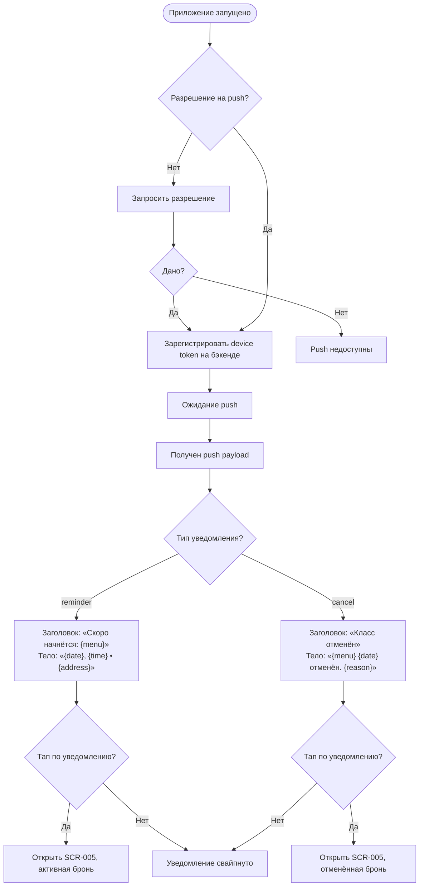

# Push-уведомления

**ID:** LOGIC-006  
**Тип:** Логика  
**Домен:** 09. Логики  
**Приоритет:** High  
**Статус:** Черновик  
**Функциональные блоки:** —  

---

## История изменений

| Релиз | ТЗ | Описание изменений |
|-------|-----|-------------------|
| — | — | Первоначальная документация |

---

## Обзор

Обработка push-уведомлений от бэкенда: запрос разрешения у пользователя, получение и отображение системных уведомлений, навигация по тапу на уведомление. Поддерживаются два типа уведомлений (FR-5.1, FR-5.2).

### User Story

> Как Клиент, я хочу получать push-напоминания о предстоящем классе и уведомления об отмене,
> чтобы не пропустить занятие и вовремя узнавать об изменениях.

### Бизнес-ценность

- Снижение no-show за счёт напоминаний (24ч, 3ч, 30мин)
- Мгновенное информирование об отмене студией (FR-5.2)
- Повышение вовлечённости

---

## Точки применения

| Экран/Компонент | Элемент/Триггер | Условие |
|-----------------|-----------------|---------|
| [SCR-007](../SCR-007_Profile.md) | Раздел настроек | Запрос разрешения на push |
| [SCR-001](../SCR-001_Schedule.md) | Фоновый приём | Уведомление приходит, когда приложение в фоне |
| [SCR-005](../SCR-005_MyBookings.md) | Тап по уведомлению | Навигация к активной / отменённой брони |

---

## Флоу



---

## Описание логики

### Запрос разрешения

- При первом запуске или переходе в профиль: запросить `POST_NOTIFICATIONS` (Android 13+) через системный диалог.
- После получения разрешения: отправить device token на бэкенд (вне скоупа спецификации API, обеспечивается бэкенд-командой).
- Если отказано: push-уведомления недоступны, в настройках профиля — подсказка «Разрешите уведомления в настройках телефона».

### Типы уведомлений (из 00-foundations.md §4)

| Тип | Событие | Заголовок | Тело | Навигация по тапу |
|-----|---------|-----------|------|-------------------|
| `reminder` | Напоминание (24ч / 3ч / 30мин) | «Скоро начнётся: {menu}» | «{date}, {time} • {address}» | SCR-005, активная бронь |
| `cancel` | Отмена студией | «Класс отменён» | «{menu} {date} отменён. {reason}» | SCR-005, отменённая бронь |

### Payload (ожидаемый формат)

```json
{
  "type": "reminder" | "cancel",
  "bookingId": "uuid",
  "slotId": "uuid",
  "title": "string",
  "body": "string",
  "reason": "string (только для cancel)"
}
```

### Навигация по тапу

1. Распарсить `type` и `bookingId` из payload.
2. Если приложение в фоне — открыть SCR-005 с параметром `bookingId`.
3. Если приложение активно — показать snackbar «Напоминание о классе» / «Класс отменён» + подсветить соответствующую бронь.

### Отображение внутри приложения

- **Canvas-уведомления (snackbar):** для кратких подтверждений после действий пользователя («Бронь создана», «Бронь отменена», «Оценка сохранена») — не push, а локальные.
- **Push-уведомления:** системные, отображаются в шторке уведомлений Android.

---

## Критерии приёмки

| ID | Критерий |
|----|----------|
| AC-001 | **Дано** приложение запущено первый раз, **Когда** пользователь заходит в профиль, **Тогда** запрашивается системное разрешение на push |
| AC-002 | **Дано** бэкенд отправил `reminder`, **Когда** пользователь тапает по уведомлению, **Тогда** открывается SCR-005 с фокусом на активную бронь |
| AC-003 | **Дано** бэкенд отправил `cancel`, **Когда** пользователь тапает по уведомлению, **Тогда** открывается SCR-005 с фокусом на отменённую бронь |
| AC-004 | **Дано** пользователь отказал в push, **Когда** открыт профиль, **Тогда** отображается подсказка «Разрешите уведомления в настройках телефона» |
