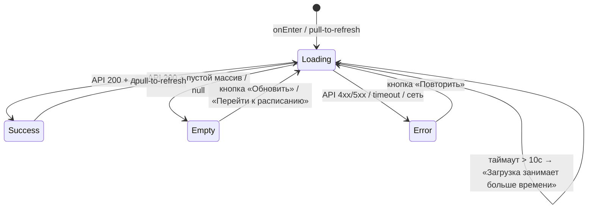
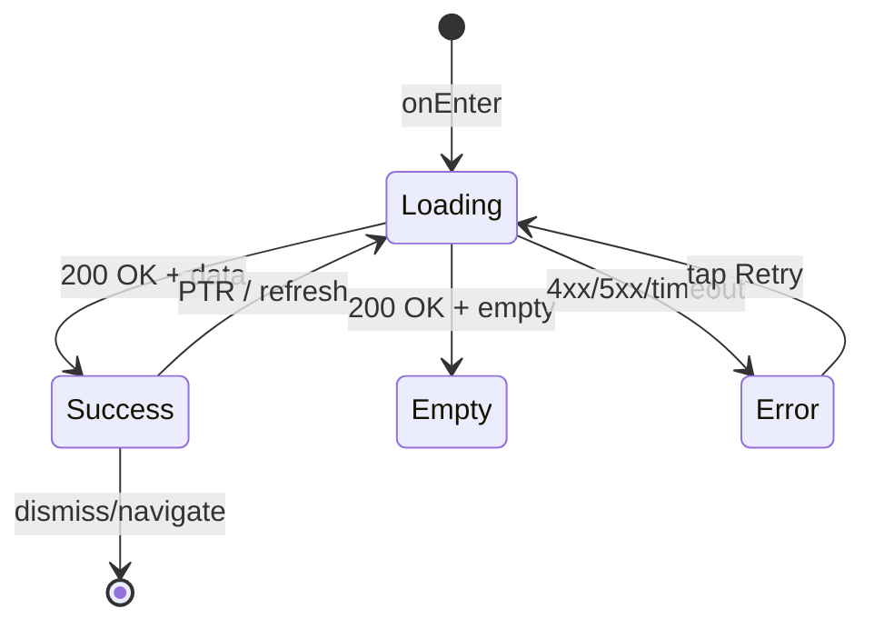

# Паттерн состояний (loading / empty / error / success)

**ID:** LOGIC-007  
**Тип:** Логика  
**Домен:** 09. Логики  
**Приоритет:** Critical  
**Статус:** Черновик  
**Функциональные блоки:** —  

---

## История изменений

| Релиз | ТЗ | Описание изменений |
|-------|-----|-------------------|
| — | — | Первоначальная документация |

---

## Обзор

Паттерн управления состояниями экрана для всех экранов, загружающих данные асинхронно через API. Четыре состояния: **loading**, **empty**, **error**, **success**. Подробное описание UI-поведения — в `../3-design-brief/00-foundations.md` §3. Данный документ описывает логику переходов между состояниями и общие правила для всех экранов.

---

## Точки применения

| Экран/Компонент | Элемент/Триггер | Условие |
|-----------------|-----------------|---------|
| ВСЕ экраны | При открытии | Загрузка данных через API |
| ВСЕ экраны | Pull-to-refresh | SCR-001, SCR-005 |
| ВСЕ экраны | Кнопка «Повторить» в error state | После ошибки |

---

## Флоу

---

## Описание состояний

### 1. Loading (Загрузка)

**Условие:** первая загрузка данных с API (расписание, брони, профиль).

**UI:** скелетон (shimmer-эффект), повторяющий форму будущего контента (прямоугольники вместо карточек, круг вместо аватара).

**Таймаут:** если загрузка > 10 секунд — показать сообщение «Загрузка занимает больше времени, чем обычно» поверх скелетона.

**Правило:** loading показывается только при первой загрузке. При pull-to-refresh (SCR-001, SCR-005) — нативный индикатор обновления, не скелетон.

### 2. Empty (Пусто)

**Условие:** API вернул 200, но данные пусты.

**UI:** иконка-иллюстрация по центру экрана + пояснительный текст + опциональная кнопка действия.

**Тексты (из 00-foundations.md §3.2):**

| Экран | Текст | Кнопка |
|-------|-------|--------|
| SCR-001 (расписание) | «Пока нет доступных классов» | «Обновить» |
| SCR-005 (брони) | «У вас пока нет броней» | «Перейти к расписанию» |
| История броней | «За последние 3 месяца броней не найдено» | — |

### 3. Error (Ошибка)

**Условие:** ошибка сети, таймаут, HTTP 5xx, HTTP 4xx (кроме 401).

**UI:** иконка ошибки + текст «Что-то пошло не так» + описание ошибки (если есть от API: поле `message`) + кнопка «Повторить».

**Специальные случаи:**

| Код | Действие |
|-----|----------|
| 401 | НЕ показывать error state. Редирект на SCR-006 (см. LOGIC-001) |
| 403 | Показать текст ошибки из `message` в поле ответа |
| 404 | Показать текст «Не найдено» или `message` из ответа |
| 409 | Зависит от контекста: может быть error state или снек (см. спецификацию экрана) |
| 410 | Зависит от контекста (см. спецификацию экрана) |
| 5xx | Стандартный error state с кнопкой «Повторить» |
| Сеть отсутствует | Стандартный error state с кнопкой «Повторить» |

### 4. Success (Данные)

**Условие:** API вернул 200 с данными.

**UI:** контент экрана согласно спецификации SCR-* / BS-*.

**Pull-to-refresh:** поддерживается на SCR-001 (расписание) и SCR-005 (брони). При PTR → loading (нативный индикатор) → Success / Empty / Error.

---

## Диаграмма переходов (общая)

---

## Критерии приёмки

| ID | Критерий |
|----|----------|
| AC-001 | **Дано** открыт экран с загрузкой данных, **Когда** API ещё не ответил, **Тогда** показывается скелетон-шиммер |
| AC-002 | **Дано** загрузка > 10 секунд, **Когда** таймер срабатывает, **Тогда** показывается текст «Загрузка занимает больше времени, чем обычно» |
| AC-003 | **Дано** API вернул пустой массив, **Когда** загрузка завершена, **Тогда** показывается empty state с иконкой и текстом |
| AC-004 | **Дано** ошибка сети, **Когда** загрузка завершена, **Тогда** показывается error state с кнопкой «Повторить» |
| AC-005 | **Дано** API вернул 401, **Когда** любой запрос, **Тогда** редирект на SCR-006 (не error state) |
| AC-006 | **Дано** error state, **Когда** пользователь тапает «Повторить», **Тогда** повторяется запрос, экран возвращается в Loading |
| AC-007 | **Дано** pull-to-refresh на SCR-001/SCR-005, **Когда** пользователь тянет вниз, **Тогда** нативный индикатор обновления, данные перезапрашиваются |
