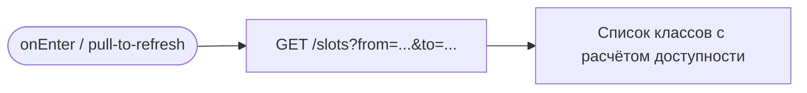
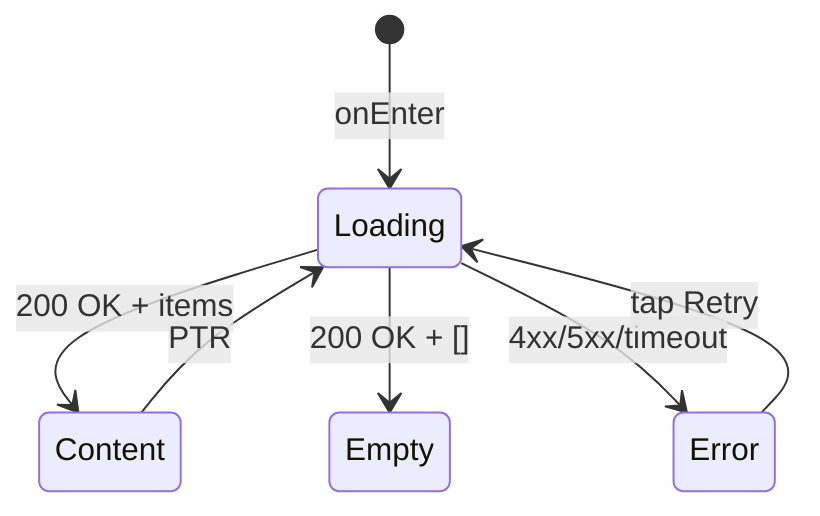

# Расписание

**ID:** SCR-001
**Тип:** Экран
**Домен:** 02. Расписание
**Приоритет:** Critical
**Статус:** Черновик
**Функциональные блоки:** —
**Зона авторизации:** АЗ (авторизованная зона)
**Дизайн-макет:** —

---

## История изменений
| Релиз | ТЗ | Описание изменений |
|-------|-----|-------------------|
| — | — | Первоначальная документация |

---

## Обзор
Главный экран приложения — Tab 1 «Расписание». Отображает список кулинарных классов на ближайшие 7 дней с фильтрацией по дате. Для каждого класса — краткая карточка со свободными местами. Пустое состояние — «Пока нет доступных классов» (FR-1.3). Запись на отменённые студией слоты заблокирована (FR-4.3).

### User Story
> Как Клиент, я хочу видеть расписание классов на ближайшие 7 дней с фильтрацией по дате,
> чтобы быстро находить кулинарные мастер-классы в удобные для меня дни.

### Бизнес-ценность
- Точка входа в процесс записи (UC-1)
- Быстрый обзор доступных классов
- Pull-to-refresh для актуализации

---

## Навигация

### Входящая
| Источник | Триггер | Условие | Передаваемые параметры |
|----------|---------|---------|------------------------|
| Tab Bar | Тап на «Расписание» | Всегда | — |
| SCR-006 | Успешная авторизация | После verifyOtp | — |

### Исходящая
| Назначение | Триггер | Передаваемые параметры |
|------------|---------|------------------------|
| [SCR-002_ClassDetail](SCR-002_ClassDetail.md) | Тап по карточке класса | `slotId` |
| [BS-004_FilterDate](BS-004_FilterDate.md) | Тап по кнопке фильтра дат | Текущие `from`/`to` |

---

## Входные данные
| Название | Тип | Возможные значения | Описание |
|----------|-----|-------------------|----------|
| `filterFrom` | Состояние | `YYYY-MM-DD` | Начало диапазона фильтрации (по умолчанию — сегодня) |
| `filterTo` | Состояние | `YYYY-MM-DD` | Конец диапазона (from + 7 дней) |

---

## Применяемые логики
| Логика | Элемент/Триггер | Описание |
|--------|-----------------|----------|
| [LOGIC-002 Расчёт доступности](00_Логики/LOGIC-002_Доступность.md) | Каждая карточка класса | свободно = capacity − bookedCount; canBook |
| [LOGIC-005 Фильтрация по дате](00_Логики/LOGIC-005_Фильтрация_по_дате.md) | Кнопка фильтра + запрос listSlots | Параметры from/to, 7 дней |
| [LOGIC-007 Паттерн состояний](00_Логики/LOGIC-007_Состояния.md) | Весь экран | Loading / Empty / Error / Success |

---

## Инициализация

### Диаграмма загрузки


### Запросы при открытии
| № | Запрос | Критичный | Зависит от | Условие |
|---|--------|-----------|------------|---------|
| 1 | [listSlots](#listslots) | Да | — | Всегда |

---

## Используемые запросы

### listSlots
**Тип:** REST
**Метод:** GET
**Спецификация:** [../api/slots/api.yaml](../api/slots/api.yaml) → `listSlots`

**Триггер:** Инициализация, pull-to-refresh, изменение фильтра дат

**Параметры:**
| Параметр | Тип | Обязательность | Источник | Описание |
|----------|-----|----------------|----------|----------|
| `from` | string (date) | Нет | `filterFrom` (состояние) | Начало периода, по умолчанию сегодня |
| `to` | string (date) | Нет | `filterTo` (состояние) | Конец периода, по умолчанию from + 7 дней |

**Обработка ответа:**
| Результат | Условие | UI-реакция |
|-----------|---------|------------|
| Загрузка | — | Скелетон-шиммер (первая загрузка) / Нативный PTR-индикатор |
| Успех | `items` не пуст | Отобразить список карточек, для каждой применить LOGIC-002 |
| Успех | `items` пуст | Empty state: «Пока нет доступных классов» + кнопка «Обновить» |
| HTTP 401 | — | Редирект на SCR-006 (LOGIC-001) |
| HTTP 4xx | — | Error state с кнопкой «Обновить» |
| HTTP 5xx | — | Error state с кнопкой «Обновить» |
| Сеть | Нет соединения | Error state с кнопкой «Обновить» |

---

**Доступные спецификации (REST):**
- `auth` — [../api/auth/api.yaml](../api/auth/api.yaml)
- `slots` — [../api/slots/api.yaml](../api/slots/api.yaml)
- `bookings` — [../api/bookings/api.yaml](../api/bookings/api.yaml)
- `profile` — [../api/profile/api.yaml](../api/profile/api.yaml)
- `instructors` — [../api/instructors/api.yaml](../api/instructors/api.yaml)

---

## Макет экрана

### Структура
```
┌─────────────────────────────────────┐
│ Расписание              [📅 Фильтр] │  ← Top App Bar
├─────────────────────────────────────┤
│ ┌─────────────────────────────────┐ │
│ │ 12 июля, Вс • 14:00            │ │
│ │ Итальянская паста              │ │
│ │ Шеф: Анна Р.  ★ 4.8           │ │
│ │ Для новичков                   │ │
│ │ Осталось 3 из 12    3 500 ₽    │ │  ← Card (тап → SCR-002)
│ └─────────────────────────────────┘ │
│ ┌─────────────────────────────────┐ │
│ │ 13 июля, Пн • 16:00            │ │
│ │ Японские роллы                 │ │
│ │ Шеф: Дмитрий К.  ★ 4.5         │ │
│ │ Для опытных                    │ │
│ │ Мест нет             4 200 ₽    │ │  ← Card (неактивна)
│ └─────────────────────────────────┘ │
│ ┌─────────────────────────────────┐ │
│ │ 14 июля, Вт • 10:00            │ │
│ │ Французские круассаны          │ │
│ │ Шеф: Елена В.  ★ 4.9           │ │
│ │ Для новичков                   │ │
│ │ Осталось 5 из 8     2 800 ₽    │ │
│ └─────────────────────────────────┘ │
│              ...                    │
├─────────────────────────────────────┤
│  [🏠 Расписание] [🎫 Брони] [👤 Профиль] │  ← Tab Bar
└─────────────────────────────────────┘
```

### Компоненты
| Компонент | Описание | Обязательность |
|-----------|----------|----------------|
| Top App Bar | Заголовок «Расписание» + кнопка фильтра дат | Да |
| Список карточек | RecyclerView / LazyColumn с карточками Slot | Да |
| Карточка класса | Краткая информация о слоте (см. элементы) | Да |
| Tab Bar | Нижняя навигация (3 вкладки) | Да |

---

## Элементы экрана

### 1. Top App Bar
| Элемент | Описание | Источник данных | Валидация | Действие |
|---------|----------|-----------------|-----------|----------|
| Заголовок «Расписание» | Название экрана | — | — | — |
| Кнопка фильтра (📅) | Иконка календаря + выбранная дата | `filterFrom` (состояние) | — | Открыть [BS-004](BS-004_FilterDate.md) |

### 2. Карточка класса (каждый элемент списка)
| Элемент | Описание | Источник данных | Валидация | Действие |
|---------|----------|-----------------|-----------|----------|
| Дата и время | Формат: «12 июля, Вс • 14:00» | `slot.dateTime` из listSlots | — | — |
| Название программы | Меню / программа | `slot.menu` | — | — |
| Шеф и рейтинг | «Шеф: {name} ★ {rating}» | `slot.instructor.name`, `slot.instructor.rating` | — | — |
| Уровень сложности | «Для новичков» / «Для опытных» | `slot.difficulty` | — | — |
| Свободные места | «Осталось N из M» или «Мест нет» | LOGIC-002: `capacity − bookedCount` | — | — |
| Цена | «{price} ₽» | `slot.price` (LOGIC-003) | — | — |
| Статус (если отменён) | Бейдж «Отменён» | `slot.status == "Отменён студией"` | — | — |
| Карточка целиком | — | — | — | Тап → SCR-002 с `slotId` |

**Логика:**
- Свободные места: [LOGIC-002](00_Логики/LOGIC-002_Доступность.md) — расчёт `свободно = capacity − bookedCount` и `canBook`.
- Цена: [LOGIC-003](00_Логики/LOGIC-003_Цена_возврат.md) — отображение `price` из API.
- Фильтрация: [LOGIC-005](00_Логики/LOGIC-005_Фильтрация_по_дате.md) — параметры `from`/`to` для `listSlots`.

**Условия доступности:**
- Карточка отменённого класса (`status == "Отменён студией"`): отображается бейдж «Отменён», тап по карточке — переход на SCR-002, но кнопка «Записаться» будет неактивна (FR-4.3).
- Карточка с `bookedCount >= capacity`: текст «Мест нет», карточка кликабельна (переход на SCR-002 для деталей).

---

## Состояния экрана

### Таблица состояний
| Состояние | Условие | Отображение |
|-----------|---------|-------------|
| Loading | Первая загрузка | Скелетон-шиммер (прямоугольники-карточки) |
| Content | API 200 + items | Список карточек классов |
| Empty | API 200 + пустой items | Иконка + «Пока нет доступных классов» + кнопка «Обновить» |
| Error | API 4xx/5xx/сеть | Иконка ошибки + «Что-то пошло не так» + кнопка «Повторить» |

### Диаграмма переходов


---

## Действия пользователя
| Действие | Элемент | Триггер | Результат |
|----------|---------|---------|-----------|
| Открыть карточку класса | Карточка класса | Tap | Переход на SCR-002 с `slotId` |
| Открыть фильтр дат | Кнопка фильтра (📅) | Tap | Открыть BS-004 |
| Обновить расписание | Pull-to-refresh | Свайп вниз | Перезапрос `listSlots` |
| Повторить загрузку | Кнопка «Повторить» | Tap | Перезапрос `listSlots` |

---

## Связанные требования

### Функциональные (FR-*)
| ID | Название | Приоритет |
|----|----------|-----------|
| FR-1.1 | Отображение расписания на 7 дней | High |
| FR-1.2 | Фильтрация только по дате | High |
| FR-1.3 | Empty state «Пока нет доступных классов» | High |
| FR-4.3 | Блокировка записи на отменённые слоты | High |

### Сценарии использования (UC-*)
| ID | Название | Приоритет |
|----|----------|-----------|
| UC-1 (шаги 1–2) | Просмотр расписания и выбор класса | High |

### Пользовательские истории (US-*)
| ID | Название | Приоритет |
|----|----------|-----------|
| US-3 | Просмотр расписания на 7 дней с фильтрацией по дате | High |

---

## Критерии приёмки

### Позитивные сценарии
| ID | Критерий | Приоритет |
|----|----------|-----------|
| AC-001 | **Дано** авторизованный пользователь, **Когда** открывает Tab «Расписание», **Тогда** видит список классов на 7 дней от сегодня | P0 |
| AC-002 | **Дано** загружен список, **Когда** карточка показывает `capacity=12, bookedCount=9`, **Тогда** текст «Осталось 3 из 12» | P0 |
| AC-003 | **Дано** загружен список, **Когда** тап по карточке, **Тогда** переход на SCR-002 с `slotId` | P0 |
| AC-004 | **Дано** загружен список, **Когда** pull-to-refresh, **Тогда** перезапрос `listSlots`, обновление списка | P1 |
| AC-005 | **Дано** слот отменён (`status="Отменён студией"`), **Когда** отображается карточка, **Тогда** виден бейдж «Отменён» | P0 |

### Негативные сценарии
| ID | Критерий | Приоритет |
|----|----------|-----------|
| AC-N01 | **Дано** ошибка сети, **Когда** открытие экрана, **Тогда** error state с кнопкой «Повторить» | P0 |
| AC-N02 | **Дано** пустой ответ API (`items: []`), **Когда** загрузка завершена, **Тогда** empty state «Пока нет доступных классов» + кнопка «Обновить» | P0 |
| AC-N03 | **Дано** API возвращает 401, **Когда** запрос listSlots, **Тогда** редирект на SCR-006 | P0 |

### Граничные условия
| ID | Критерий | Приоритет |
|----|----------|-----------|
| AC-E01 | **Дано** загрузка > 10 секунд, **Когда** таймаут, **Тогда** сообщение «Загрузка занимает больше времени, чем обычно» | P2 |
| AC-E02 | **Дано** `bookedCount` изменился во время просмотра, **Когда** pull-to-refresh, **Тогда** обновлённый счётчик «Осталось N из M» | P1 |
