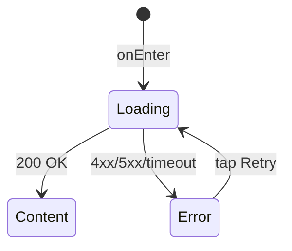

# Карточка класса

**ID:** SCR-002
**Тип:** Экран
**Домен:** 02. Расписание
**Приоритет:** Critical
**Статус:** Черновик
**Функциональные блоки:** —
**Зона авторизации:** АЗ
**Дизайн-макет:** —

---

## История изменений
| Релиз | ТЗ | Описание изменений |
|-------|-----|-------------------|
| — | — | Первоначальная документация |

---

## Обзор
Детальная карточка кулинарного класса. Отображает полную информацию: дата/время, меню + фото, сложность, шеф + рейтинг, свободные места, цена, адрес, статус (FR-1.4). Кнопка «Записаться» ведёт на SCR-003. Доступность записи — LOGIC-002 (pre-check). Шеф приходит inline в ответе `getSlot` — отдельный запрос `getInstructor` не нужен.

### User Story
> Как Клиент, я хочу видеть подробную карточку класса: меню, шефа, его рейтинг, сложность, цену, адрес и точное количество свободных мест,
> чтобы принять осознанное решение о записи на занятие.

### Бизнес-ценность
- Информированное решение о записи
- Прозрачность: цена, места, рейтинг шефа
- Точка входа в процесс бронирования (UC-1 шаг 2)

---

## Навигация

### Входящая
| Источник | Триггер | Условие | Передаваемые параметры |
|----------|---------|---------|------------------------|
| [SCR-001_Schedule](SCR-001_Schedule.md) | Тап по карточке класса | Всегда | `slotId` |

### Исходящая
| Назначение | Триггер | Передаваемые параметры |
|------------|---------|------------------------|
| [SCR-003_BookingForm](SCR-003_BookingForm.md) | Тап «Записаться» | `slotId` |

---

## Входные данные
| Название | Тип | Возможные значения | Описание |
|----------|-----|-------------------|----------|
| `slotId` | Параметр навигации | UUID | Идентификатор слота, переданный из SCR-001 |

---

## Применяемые логики
| Логика | Элемент/Триггер | Описание |
|--------|-----------------|----------|
| [LOGIC-002 Расчёт доступности](00_Логики/LOGIC-002_Доступность.md) | Блок свободных мест + кнопка «Записаться» | canBook; текст «Осталось N из M» / «Мест нет» |
| [LOGIC-003 Цена/возврат](00_Логики/LOGIC-003_Цена_возврат.md) | Блок стоимости | Отображение `slot.price` |
| [LOGIC-007 Паттерн состояний](00_Логики/LOGIC-007_Состояния.md) | Весь экран | Loading / Error / Success |

---

## Инициализация

### Диаграмма загрузки
```mermaid
flowchart LR
    Start([onEnter: slotId]) --> GetSlot[GET /slots/{slotId}]
    GetSlot --> ShowDetail[Карточка класса]
```

### Запросы при открытии
| № | Запрос | Критичный | Зависит от | Условие |
|---|--------|-----------|------------|---------|
| 1 | [getSlot](#getslot) | Да | — | Всегда |

---

## Используемые запросы

### getSlot
**Тип:** REST
**Метод:** GET
**Спецификация:** [../api/slots/api.yaml](../api/slots/api.yaml) → `getSlot`

**Триггер:** Инициализация

**Параметры:**
| Параметр | Тип | Обязательность | Источник | Описание |
|----------|-----|----------------|----------|----------|
| `slotId` | string (UUID) | Да | Входной параметр | ID слота |

**Обработка ответа:**
| Результат | Условие | UI-реакция |
|-----------|---------|------------|
| Загрузка | — | Скелетон-шиммер (фото-прямоугольник, строки текста) |
| Успех (200) | — | Отобразить карточку класса, применить LOGIC-002, LOGIC-003 |
| HTTP 401 | — | Редирект на SCR-006 (LOGIC-001) |
| HTTP 404 | — | Error state: «Класс не найден» |
| HTTP 5xx | — | Error state с кнопкой «Повторить» |
| Сеть | Нет соединения | Error state с кнопкой «Повторить» |

---

**Доступные спецификации (REST):**
- `auth` — [../api/auth/api.yaml](../api/auth/api.yaml)
- `slots` — [../api/slots/api.yaml](../api/slots/api.yaml)
- `bookings` — [../api/bookings/api.yaml](../api/bookings/api.yaml)
- `profile` — [../api/profile/api.yaml](../api/profile/api.yaml)
- `instructors` — [../api/instructors/api.yaml](../api/instructors/api.yaml)

---

## Макет экрана

### Структура
```
┌─────────────────────────────────────┐
│ [←] Карточка класса                 │  ← Top App Bar
├─────────────────────────────────────┤
│ ┌─────────────────────────────────┐ │
│ │                                 │ │
│ │     Фото блюда (placeholder)    │ │  ← Карусель photoUrls
│ │                                 │ │
│ └─────────────────────────────────┘ │
│                                     │
│ Итальянская паста                   │  ← menu
│                                     │
│ 📅 12 июля, Вс • 14:00–17:00       │  ← dateTime
│ 📍 Лофт на территории завода       │  ← address
│ 👨‍🍳 Шеф: Анна Росси  ★ 4.8          │  ← instructor (inline)
│ 📊 Для новичков                     │  ← difficulty
│                                     │
│ ┌─────────────────────────────────┐ │
│ │ Свободные места                 │ │
│ │ Осталось 3 из 12                │ │  ← LOGIC-002
│ │ ████████░░░░  (progress bar)    │ │
│ └─────────────────────────────────┘ │
│                                     │
│ Стоимость: 3 500 ₽                  │  ← LOGIC-003
│                                     │
│ ⚠️  Класс отменён студией           │  ← если status != "Активен"
│                                     │
├─────────────────────────────────────┤
│       [Записаться — 3 500 ₽]        │  ← Fixed Bottom CTA
└─────────────────────────────────────┘
```

### Компоненты
| Компонент | Описание | Обязательность |
|-----------|----------|----------------|
| Top App Bar | Кнопка «Назад» + заголовок | Да |
| Карусель фото блюд | `photoUrls` — горизонтальный скролл | Да (если есть фото) |
| Информационный блок | Меню, дата/время, адрес, шеф, сложность | Да |
| Блок свободных мест | Текст + progress bar | Да |
| Блок стоимости | Цена участия | Да |
| Кнопка «Записаться» | Primary CTA, fixed bottom | Да |
| Бейдж «Отменён» | Предупреждение, если `status="Отменён студией"` | Условно |

---

## Элементы экрана

### 1. Карусель фото блюд
| Элемент | Описание | Источник данных | Валидация | Действие |
|---------|----------|-----------------|-----------|----------|
| Фото блюда | Изображение | `slot.photoUrls[i]` | — | Тап → полноэкранный просмотр |
| Placeholder | Серый прямоугольник + иконка фотоаппарата | — | — | Пока фото загружается |

### 2. Информационный блок
| Элемент | Описание | Источник данных | Валидация | Действие |
|---------|----------|-----------------|-----------|----------|
| Меню | Название программы | `slot.menu` | — | — |
| Дата и время | «12 июля, Вс • 14:00–17:00» | `slot.dateTime` | — | — |
| Адрес | Текст адреса | `slot.address` | — | — |
| Шеф и рейтинг | «Шеф: {name} ★ {rating}» | `slot.instructor.name`, `slot.instructor.rating` (inline) | — | — |
| Сложность | «Для новичков» / «Для опытных» | `slot.difficulty` | — | — |

### 3. Блок свободных мест
| Элемент | Описание | Источник данных | Валидация | Действие |
|---------|----------|-----------------|-----------|----------|
| Текст | «Осталось {свободно} из {capacity}» | LOGIC-002 | — | — |
| Progress bar | Визуализация заполненности | LOGIC-002 | — | — |

### 4. Кнопка «Записаться»
| Элемент | Описание | Источник данных | Валидация | Действие |
|---------|----------|-----------------|-----------|----------|
| Кнопка «Записаться — {price} ₽» | Primary CTA | `slot.price` (LOGIC-003) | — | → SCR-003 с `slotId` |
| Бейдж «Отменён» | «Класс отменён студией» | `slot.status` | — | Кнопка неактивна |

**Логика:**
- Свободные места и доступность: [LOGIC-002](00_Логики/LOGIC-002_Доступность.md)
- Цена: [LOGIC-003](00_Логики/LOGIC-003_Цена_возврат.md)

**Условия доступности:**
- Кнопка «Записаться» активна, если: `canBook == true` (LOGIC-002)
- Кнопка неактивна + текст причины:
  - `status != "Активен"` → «Класс отменён студией»
  - `now > dateTime − 10мин` → «Запись закрыта»
  - `bookedCount >= capacity` → «Мест нет»

---

## Состояния экрана

### Таблица состояний
| Состояние | Условие | Отображение |
|-----------|---------|-------------|
| Loading | Ожидание getSlot | Скелетон-шиммер |
| Content | API 200 | Полная карточка класса |
| Error | API 4xx/5xx/сеть | Error state с кнопкой «Повторить» |

### Диаграмма переходов


---

## Действия пользователя
| Действие | Элемент | Триггер | Результат |
|----------|---------|---------|-----------|
| Записаться на класс | Кнопка «Записаться» | Tap | Переход на SCR-003 с `slotId` |
| Вернуться к расписанию | Кнопка «Назад» (←) | Tap | Возврат на SCR-001 |
| Просмотр фото | Фото в карусели | Tap | Полноэкранный просмотр |
| Повторить загрузку | Кнопка «Повторить» | Tap | Перезапрос getSlot |

---

## Связанные требования

### Функциональные (FR-*)
| ID | Название | Приоритет |
|----|----------|-----------|
| FR-1.4 | Карточка класса со всеми атрибутами | High |
| FR-3.1 | Запись не позднее 10 мин до начала, блокировка при нехватке мест | High |

### Сценарии использования (UC-*)
| ID | Название | Приоритет |
|----|----------|-----------|
| UC-1 (шаг 2) | Просмотр деталей класса | High |

### Пользовательские истории (US-*)
| ID | Название | Приоритет |
|----|----------|-----------|
| US-4 | Подробная карточка класса | High |
| US-5 | Возможность забронировать место не позднее 10 мин до начала | High |

---

## Критерии приёмки

### Позитивные сценарии
| ID | Критерий | Приоритет |
|----|----------|-----------|
| AC-001 | **Дано** переход с SCR-001 с slotId, **Когда** getSlot возвращает 200, **Тогда** отображается полная карточка: меню, дата/время, шеф+рейтинг, сложность, «Осталось N из M», цена, адрес | P0 |
| AC-002 | **Дано** слот доступен (canBook=true), **Когда** нажата кнопка «Записаться», **Тогда** переход на SCR-003 с slotId | P0 |
| AC-003 | **Дано** `status="Отменён студией"`, **Когда** карточка отображается, **Тогда** бейдж «Класс отменён студией», кнопка «Записаться» неактивна | P0 |
| AC-004 | **Дано** `bookedCount >= capacity`, **Когда** карточка отображается, **Тогда** текст «Мест нет», кнопка неактивна | P0 |
| AC-005 | **Дано** `now > dateTime - 10мин`, **Когда** карточка отображается, **Тогда** текст «Запись закрыта», кнопка неактивна | P0 |

### Негативные сценарии
| ID | Критерий | Приоритет |
|----|----------|-----------|
| AC-N01 | **Дано** ошибка сети, **Когда** открытие экрана, **Тогда** error state с кнопкой «Повторить» | P0 |
| AC-N02 | **Дано** API 404, **Когда** getSlot, **Тогда** сообщение «Класс не найден» | P1 |
| AC-N03 | **Дано** API 401, **Когда** getSlot, **Тогда** редирект на SCR-006 | P0 |
