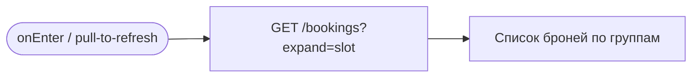
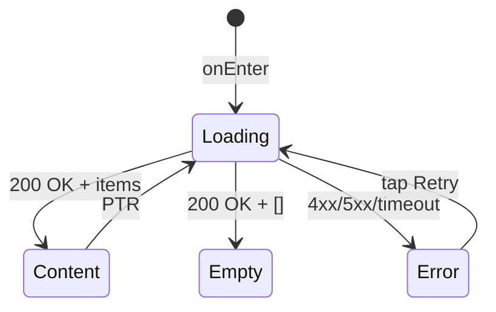

# Мои брони

**ID:** SCR-005
**Тип:** Экран
**Домен:** 04. Брони
**Приоритет:** High
**Статус:** Черновик
**Функциональные блоки:** —
**Зона авторизации:** АЗ
**Дизайн-макет:** —

---

## История изменений
| Релиз | ТЗ | Описание изменений |
|-------|-----|-------------------|
| — | — | Первоначальная документация |

---

## Обзор
Tab 2 «Мои брони». Отображает историю броней клиента за последние 3 месяца, сгруппированных по статусу: «Активные», «Завершённые», «Отменённые». Для каждой брони — краткая карточка с основными атрибутами и кнопками действий (отменить, перенести, оценить). Empty state: «У вас пока нет броней». Pull-to-refresh.

### User Story
> Как Клиент, я хочу видеть историю своих броней за последние 3 месяца,
> чтобы отслеживать свои текущие и прошлые активности в студии.

### Бизнес-ценность
- Централизованное управление бронями
- Быстрый доступ к отмене, переносу, оценке
- История за 3 месяца (FR-2.4)

---

## Навигация

### Входящая
| Источник | Триггер | Условие | Передаваемые параметры |
|----------|---------|---------|------------------------|
| Tab Bar | Тап на «Мои брони» | Всегда | — |
| SCR-004 | Тап «Мои брони» | После успешного бронирования | — |
| Push-уведомление | Тап на reminder / cancel | type = `reminder` \| `cancel` | `bookingId` |

### Исходящая
| Назначение | Триггер | Передаваемые параметры |
|------------|---------|------------------------|
| [BS-001_CancelConfirm](BS-001_CancelConfirm.md) | Кнопка «Отменить» (активная бронь) | `bookingId` |
| [BS-002_TransferSelect](BS-002_TransferSelect.md) | Кнопка «Перенести» (активная бронь) | `bookingId` |
| [BS-003_RateChef](BS-003_RateChef.md) | Кнопка «Оценить шефа» / «Редактировать оценку» | `bookingId` |

---

## Применяемые логики
| Логика | Элемент/Триггер | Описание |
|--------|-----------------|----------|
| [LOGIC-003 Цена/возврат](00_Логики/LOGIC-003_Цена_возврат.md) | Карточка отменённой брони | Отображение `refundAmount` |
| [LOGIC-004 Правило 12ч отмены](00_Логики/LOGIC-004_Правило_12ч_отмены.md) | Кнопка «Отменить» → расчёт remaining | Pre-check для BS-001 |
| [LOGIC-007 Паттерн состояний](00_Логики/LOGIC-007_Состояния.md) | Весь экран | Loading / Empty / Error / Success |

---

## Инициализация

### Диаграмма загрузки


### Запросы при открытии
| № | Запрос | Критичный | Зависит от | Условие |
|---|--------|-----------|------------|---------|
| 1 | [listBookings](#listbookings) | Да | — | Всегда |

---

## Используемые запросы

### listBookings
**Тип:** REST
**Метод:** GET
**Спецификация:** [../api/bookings/api.yaml](../api/bookings/api.yaml) → `listBookings`

**Триггер:** Инициализация, pull-to-refresh

**Параметры:**
| Параметр | Тип | Обязательность | Источник | Описание |
|----------|-----|----------------|----------|----------|
| `expand` | array[string] | Да | Константа `["slot"]` | Развернуть slot (включая inline instructor) для каждого элемента |

**Обработка ответа:**
| Результат | Условие | UI-реакция |
|-----------|---------|------------|
| Загрузка | — | Скелетон-шиммер (первая загрузка) / нативный PTR |
| Успех | `items` не пуст | Список броней, сгруппированных по статусу |
| Успех | `items` пуст | Empty state: «У вас пока нет броней» + кнопка «Перейти к расписанию» |
| HTTP 401 | — | Редирект на SCR-006 (LOGIC-001) |
| HTTP 4xx | — | Error state с кнопкой «Обновить» |
| HTTP 5xx | — | Error state с кнопкой «Обновить» |
| Сеть | Нет соединения | Error state с кнопкой «Обновить» |

---

**Доступные спецификации (REST):**
- `auth` — [../api/auth/api.yaml](../api/auth/api.yaml)
- `slots` — [../api/slots/api.yaml](../api/slots/api.yaml)
- `bookings` — [../api/bookings/api.yaml](../api/bookings/api.yaml)
- `profile` — [../api/profile/api.yaml](../api/profile/api.yaml)
- `instructors` — [../api/instructors/api.yaml](../api/instructors/api.yaml)

---

## Макет экрана

### Структура
```
┌─────────────────────────────────────┐
│ Мои брони                           │  ← Top App Bar
├─────────────────────────────────────┤
│ ── Активные ──                      │
│ ┌─────────────────────────────────┐ │
│ │ 12 июля, Вс • 14:00            │ │
│ │ Итальянская паста              │ │
│ │ Шеф: Анна Р.                   │ │
│ │ Адрес: Лофт на территории      │ │
│ │ [Отменить]      [Перенести]    │ │
│ └─────────────────────────────────┘ │
│                                     │
│ ── Завершённые ──                   │
│ ┌─────────────────────────────────┐ │
│ │ 5 июля, Сб • 16:00             │ │
│ │ Японские роллы                 │ │
│ │ Шеф: Дмитрий К.                │ │
│ │ ★★★★☆   [Редактировать оценку] │ │
│ └─────────────────────────────────┘ │
│ ┌─────────────────────────────────┐ │
│ │ 3 июля, Чт • 10:00             │ │
│ │ Французские круассаны          │ │
│ │ Шеф: Елена В.                  │ │
│ │ [Оценить шефа]                 │ │
│ └─────────────────────────────────┘ │
│                                     │
│ ── Отменённые ──                    │
│ ┌─────────────────────────────────┐ │
│ │ 1 июля, Вт • 14:00             │ │
│ │ Итальянская паста              │ │
│ │ Отменена клиентом              │ │
│ │ К возврату: 1 750 ₽            │ │
│ └─────────────────────────────────┘ │
│                                     │
├─────────────────────────────────────┤
│  [🏠 Расписание] [🎫 Брони] [👤 Профиль] │  ← Tab Bar
└─────────────────────────────────────┘
```

### Компоненты
| Компонент | Описание | Обязательность |
|-----------|----------|----------------|
| Top App Bar | Заголовок «Мои брони» | Да |
| Группа «Активные» | Брони со статусом «Активна» | Да (если есть) |
| Группа «Завершённые» | Брони со статусом «Завершена» | Да (если есть) |
| Группа «Отменённые» | Брони со статусами «Отменена клиентом», «Отменена студией», «Клиент не пришёл» | Да (если есть) |
| Tab Bar | Нижняя навигация | Да |

---

## Элементы экрана

### 1. Карточка активной брони
| Элемент | Описание | Источник данных | Валидация | Действие |
|---------|----------|-----------------|-----------|----------|
| Дата и время | «12 июля, Вс • 14:00» | `booking.slot.dateTime` (через expand=slot) | — | — |
| Меню | Название программы | `booking.slot.menu` | — | — |
| Шеф | Имя шефа | `booking.slot.instructor.name` (inline) | — | — |
| Адрес | Адрес студии | `booking.slot.address` | — | — |
| Кнопка «Отменить» | Text button / outlined | — | — | → BS-001 с `bookingId` |
| Кнопка «Перенести» | Text button / outlined | — | — | → BS-002 с `bookingId` |

**Логика:**
- Перед открытием BS-001: [LOGIC-004](00_Логики/LOGIC-004_Правило_12ч_отмены.md) — вычислить `remaining = slot.dateTime − now()` для правильного предупреждения.

### 2. Карточка завершённой брони
| Элемент | Описание | Источник данных | Валидация | Действие |
|---------|----------|-----------------|-----------|----------|
| Дата и время | «12 июля, Вс • 14:00» | `booking.slot.dateTime` | — | — |
| Меню | Название программы | `booking.slot.menu` | — | — |
| Шеф | Имя шефа | `booking.slot.instructor.name` | — | — |
| Оценка (звёзды) | ★★★★☆ (если есть) | `booking.reviewRating` | — | — |
| Кнопка «Оценить шефа» | Если `reviewRating == null` | — | — | → BS-003 с `bookingId` |
| Кнопка «Редактировать оценку» | Если `reviewRating != null` | — | — | → BS-003 с `bookingId` |

### 3. Карточка отменённой брони
| Элемент | Описание | Источник данных | Валидация | Действие |
|---------|----------|-----------------|-----------|----------|
| Дата и время | «12 июля, Вс • 14:00» | `booking.slot.dateTime` | — | — |
| Меню | Название программы | `booking.slot.menu` | — | — |
| Статус отмены | «Отменена клиентом» / «Отменена студией» | `booking.status` | — | — |
| Сумма возврата | «К возврату: {refundAmount} ₽» | `booking.refundAmount` (LOGIC-003) | — | — |

**Логика:**
- Сумма возврата: [LOGIC-003](00_Логики/LOGIC-003_Цена_возврат.md) — отображать только если `refundAmount != null`.

---

## Состояния экрана

### Таблица состояний
| Состояние | Условие | Отображение |
|-----------|---------|-------------|
| Loading | Первая загрузка listBookings | Скелетон-шиммер |
| Content | API 200 + items | Список броней, сгруппированных по статусу |
| Empty | API 200 + пустой items | Иконка + «У вас пока нет броней» + кнопка «Перейти к расписанию» |
| Error | API 4xx/5xx/сеть | Error state с кнопкой «Обновить» |

### Диаграмма переходов


---

## Действия пользователя
| Действие | Элемент | Триггер | Результат |
|----------|---------|---------|-----------|
| Отменить бронь | Кнопка «Отменить» | Tap | Pre-check LOGIC-004 → открыть BS-001 |
| Перенести бронь | Кнопка «Перенести» | Tap | Открыть BS-002 |
| Оценить шефа | Кнопка «Оценить шефа» | Tap | Открыть BS-003 |
| Редактировать оценку | Кнопка «Редактировать оценку» | Tap | Открыть BS-003 с текущими значениями |
| Обновить список | Pull-to-refresh | Свайп вниз | Перезапрос listBookings |
| Перейти к расписанию (empty) | Кнопка «Перейти к расписанию» | Tap | Переход на Tab SCR-001 |

---

## Связанные требования

### Функциональные (FR-*)
| ID | Название | Приоритет |
|----|----------|-----------|
| FR-2.4 | История броней за 3 месяца | Medium |
| FR-4.1 | Отмена брони | High |
| FR-4.2 | Перенос брони | High |
| FR-4.4 | Оценка шефа | Medium |

### Сценарии использования (UC-*)
| ID | Название | Приоритет |
|----|----------|-----------|
| UC-2 | Отмена брони клиентом | High |
| UC-3 | Перенос брони на другой класс | High |
| UC-4 | Выставление и редактирование оценки шефу | Medium |
| UC-5 | Просмотр истории броней | Medium |

### Пользовательские истории (US-*)
| ID | Название | Приоритет |
|----|----------|-----------|
| US-7 | История броней за 3 месяца | Medium |
| US-8 | Отмена брони с правилами возврата | High |
| US-9 | Перенос брони в одно действие | High |
| US-10 | Оценка шефа после класса | Medium |

---

## Критерии приёмки

### Позитивные сценарии
| ID | Критерий | Приоритет |
|----|----------|-----------|
| AC-001 | **Дано** авторизованный клиент с бронями, **Когда** открывает Tab «Мои брони», **Тогда** видит список броней, сгруппированных: Активные, Завершённые, Отменённые | P0 |
| AC-002 | **Дано** есть активная бронь, **Когда** нажата «Отменить», **Тогда** открывается BS-001 с предупреждением (LOGIC-004) | P0 |
| AC-003 | **Дано** есть активная бронь, **Когда** нажата «Перенести», **Тогда** открывается BS-002 | P0 |
| AC-004 | **Дано** завершённая бронь без оценки, **Когда** карточка отображается, **Тогда** кнопка «Оценить шефа» | P0 |
| AC-005 | **Дано** завершённая бронь с оценкой, **Когда** карточка отображается, **Тогда** звёзды + кнопка «Редактировать оценку» | P0 |
| AC-006 | **Дано** отменённая бронь с `refundAmount=1750`, **Когда** карточка отображается, **Тогда** текст «К возврату: 1 750 ₽» | P1 |
| AC-007 | **Дано** броней нет, **Когда** экран открыт, **Тогда** empty state «У вас пока нет броней» + кнопка «Перейти к расписанию» | P0 |

### Негативные сценарии
| ID | Критерий | Приоритет |
|----|----------|-----------|
| AC-N01 | **Дано** ошибка сети, **Когда** открытие экрана, **Тогда** error state с кнопкой «Обновить» | P0 |
| AC-N02 | **Дано** API 401, **Когда** listBookings, **Тогда** редирект на SCR-006 | P0 |

### Граничные условия
| ID | Критерий | Приоритет |
|----|----------|-----------|
| AC-E01 | **Дано** более 3 месяцев с даты брони, **Когда** listBookings, **Тогда** бронь не отображается (фильтр бэкенда) | P1 |
| AC-E02 | **Дано** тап по push-уведомлению reminder, **Когда** переход на SCR-005, **Тогда** список прокручивается до указанной активной брони | P2 |
