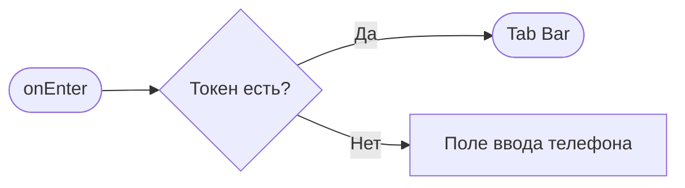

# {Название экрана/шторки}

**ID:** SCR-006
**Тип:** Экран
**Домен:** 01. Авторизация
**Приоритет:** Critical
**Статус:** Черновик
**Функциональные блоки:** —
**Зона авторизации:** НЗ (неавторизованная зона)
**Дизайн-макет:** —

---

## История изменений
| Релиз | ТЗ | Описание изменений |
|-------|-----|-------------------|
| — | — | Первоначальная документация |

---

## Обзор
Экран авторизации клиента по номеру телефона через SMS-код. Стартовый экран для неавторизованного пользователя. После успешной верификации — переход к Tab Bar (SCR-001/Script-005/SCR-007).

### User Story
> Как Клиент, я хочу авторизоваться в приложении по номеру телефона через SMS,
> чтобы войти в личный кабинет без необходимости придумывать и запоминать пароль.

### Бизнес-ценность
- Безбарьерный вход без пароля
- Телефон — первичный идентификатор
- Единственный экран вне авторизованной зоны

---

## Навигация

### Входящая
| Источник | Триггер | Условие | Передаваемые параметры |
|----------|---------|---------|------------------------|
| Запуск приложения | Холодный старт | Нет валидного токена | — |
| Любой экран | Перехват 401 | Токен истёк | — |

### Исходящая
| Назначение | Триггер | Передаваемые параметры |
|------------|---------|------------------------|
| Tab Bar (SCR-001/SCR-005/SCR-007) | Успешный verifyOtp (200) | — |

---

## Применяемые логики
| Логика | Элемент/Триггер | Описание |
|--------|-----------------|----------|
| [LOGIC-001 OTP-авторизация](00_Логики/LOGIC-001_OTP-auth.md) | Весь экран | requestOtp → verifyOtp, хранение токена, 401→реавторизация |
| [LOGIC-007 Паттерн состояний](00_Логики/LOGIC-007_Состояния.md) | Загрузка/ошибка | Loading/Error/Success |

---

## Инициализация

### Диаграмма загрузки


### Запросы при открытии
Данные не загружаются — экран состоит из полей ввода.

---

## Используемые запросы

### requestOtp
**Тип:** REST
**Метод:** POST
**Спецификация:** [../api/auth/api.yaml](../api/auth/api.yaml) → `requestOtp`

**Триггер:** Тап «Получить код»

**Body:**
| Параметр | Тип | Обязательность | Источник | Описание |
|----------|-----|----------------|----------|----------|
| `phone` | string | Да | Ввод пользователя | Номер телефона |

**Обработка ответа:**
| Результат | Условие | UI-реакция |
|-----------|---------|------------|
| Загрузка | — | Лоадер на кнопке «Получить код» |
| Успех (202) | — | Показать поле ввода SMS-кода, запустить таймер |
| HTTP 429 | rate_limited | Снек «Слишком много запросов. Повторите позже.» |
| HTTP 5xx | — | Error state с кнопкой «Повторить» |
| Сеть | Нет соединения | Снек «Нет соединения. Проверьте подключение» |

### verifyOtp
**Тип:** REST
**Метод:** POST
**Спецификация:** [../api/auth/api.yaml](../api/auth/api.yaml) → `verifyOtp`

**Триггер:** Тап «Войти»

**Body:**
| Параметр | Тип | Обязательность | Источник | Описание |
|----------|-----|----------------|----------|----------|
| `phone` | string | Да | Сохранён из шага 1 | Номер телефона |
| `code` | string | Да | Ввод пользователя | SMS-код |

**Обработка ответа:**
| Результат | Условие | UI-реакция |
|-----------|---------|------------|
| Загрузка | — | Лоадер на кнопке «Войти» |
| Успех (200) | — | Сохранить токен, переход к Tab Bar |
| HTTP 409 | invalid_code | Снек «Неверный код подтверждения.» |
| HTTP 5xx | — | Error state с кнопкой «Повторить» |
| Сеть | Нет соединения | Снек «Нет соединения. Проверьте подключение» |

---

**Доступные спецификации (REST):**
- `auth` — [../api/auth/api.yaml](../api/auth/api.yaml)
- `slots` — [../api/slots/api.yaml](../api/slots/api.yaml)
- `bookings` — [../api/bookings/api.yaml](../api/bookings/api.yaml)
- `profile` — [../api/profile/api.yaml](../api/profile/api.yaml)
- `instructors` — [../api/instructors/api.yaml](../api/instructors/api.yaml)

---

## Макет экрана

### Структура
```
┌─────────────────────────────────────┐
│                                     │
│         Логотип «Шеф-стол»          │
│                                     │
│      ┌─────────────────────┐        │
│      │ +7 (999) 123-45-67  │        │
│      └─────────────────────┘        │
│                                     │
│      ┌─────────────────────┐        │
│      │ _ _ _ _             │        │  ← появляется после requestOtp
│      └─────────────────────┘        │
│                                     │
│   [Получить код] / [Войти]          │
│                                     │
│   «Отправить код повторно через 30с»│
│                                     │
└─────────────────────────────────────┘
```

### Компоненты
| Компонент | Описание | Обязательность |
|-----------|----------|----------------|
| Иконка/логотип | Логотип «Шеф-стол» | Да |
| Поле «Телефон» | Маска +7 (XXX) XXX-XX-XX | Да |
| Поле «SMS-код» | 4 цифры, по одной в ячейке | Да (после requestOtp) |
| Кнопка «Получить код» | Primary | Да (шаг 1) |
| Кнопка «Войти» | Primary | Да (шаг 2) |
| Таймер повторной отправки | «Отправить код повторно через Nс» | Да (после requestOtp) |

---

## Элементы экрана

### 1. Шаг 1 — Ввод телефона

| Элемент | Описание | Источник данных | Валидация | Действие |
|---------|----------|-----------------|-----------|----------|
| Поле «Телефон» | Номер телефона с маской | Ввод пользователя | 11 цифр, начинается с 7. Ошибка: «Введите корректный номер телефона» | — |
| Кнопка «Получить код» | Primary CTA | — | — | → [requestOtp](#requestotp) |

**Условия доступности:**
- Кнопка «Получить код» активна, если: номер телефона валиден (11 цифр)

### 2. Шаг 2 — Ввод кода

| Элемент | Описание | Источник данных | Валидация | Действие |
|---------|----------|-----------------|-----------|----------|
| Поле «SMS-код» | 4 цифры | Ввод пользователя | Ровно 4 цифры | — |
| Кнопка «Войти» | Primary CTA | — | — | → [verifyOtp](#verifyotp) |
| Таймер «Отправить повторно» | Кнопка-ссылка | — | — | → [requestOtp](#requestotp) |

**Условия доступности:**
- Кнопка «Войти» активна, если: введены 4 цифры
- Кнопка «Отправить повторно» активна после истечения таймера (30 секунд)

---

## Состояния экрана

### Таблица состояний
| Состояние | Условие | Отображение |
|-----------|---------|-------------|
| Default | Экран открыт | Поле телефона + кнопка «Получить код» |
| CodeSent | requestOtp 202 | Поле SMS-кода + кнопка «Войти» + таймер |
| Loading | Ожидание API | Лоадер на активной кнопке |
| Error | 429 / 5xx / сеть | Снек с текстом ошибки |

---

## Действия пользователя

| Действие | Элемент | Триггер | Результат |
|----------|---------|---------|-----------|
| Запросить SMS-код | Кнопка «Получить код» | Tap | requestOtp → поле ввода кода |
| Подтвердить код | Кнопка «Войти» | Tap | verifyOtp → Tab Bar |
| Повторить отправку | Кнопка «Отправить повторно» | Tap | Повторный requestOtp |

---

## Связанные требования

### Функциональные (FR-*)
| ID | Название | Приоритет |
|----|----------|-----------|
| FR-2.1 | Регистрация и авторизация клиентов только по номеру телефона с подтверждением через SMS | High |

### Пользовательские истории (US-*)
| ID | Название | Приоритет |
|----|----------|-----------|
| US-1 | Авторизация по номеру телефона через SMS | High |

---

## Критерии приёмки

### Позитивные сценарии
| ID | Критерий | Приоритет |
|----|----------|-----------|
| AC-001 | **Дано** пользователь без токена, **Когда** открывает приложение, **Тогда** видит поле ввода телефона и кнопку «Получить код» | P0 |
| AC-002 | **Дано** введён валидный телефон, **Когда** нажимает «Получить код», **Тогда** появляется поле ввода SMS-кода и кнопка «Войти» | P0 |
| AC-003 | **Дано** введён верный SMS-код, **Когда** нажимает «Войти», **Тогда** переход к Tab Bar (SCR-001) | P0 |
| AC-004 | **Дано** таймер истёк, **Когда** нажимает «Отправить повторно», **Тогда** повторный requestOtp, новый таймер | P1 |

### Негативные сценарии
| ID | Критерий | Приоритет |
|----|----------|-----------|
| AC-N01 | **Дано** ошибка сети, **Когда** тап «Получить код», **Тогда** снек «Нет соединения. Проверьте подключение» | P0 |
| AC-N02 | **Дано** неверный SMS-код, **Когда** тап «Войти», **Тогда** снек «Неверный код подтверждения.» | P0 |
| AC-N03 | **Дано** превышен лимит запросов, **Когда** тап «Получить код», **Тогда** снек «Слишком много запросов. Повторите позже.» | P1 |

### Граничные условия
| ID | Критерий | Приоритет |
|----|----------|-----------|
| AC-E01 | **Дано** введено больше 4 цифр в поле кода, **Когда** ввод, **Тогда** лишние цифры игнорируются | P2 |
| AC-E02 | **Дано** потеря сети во время verifyOtp, **Когда** восстановление, **Тогда** возможность повторить запрос | P2 |
