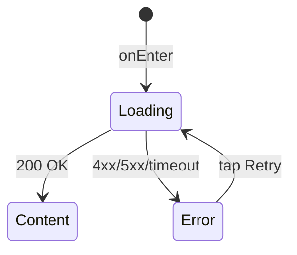

# Профиль

**ID:** SCR-007
**Тип:** Экран
**Домен:** 05. Профиль
**Приоритет:** High
**Статус:** Черновик
**Функциональные блоки:** —
**Зона авторизации:** АЗ
**Дизайн-макет:** —

---

## История изменений
| Релиз | ТЗ | Описание изменений |
|-------|-----|-------------------|
| — | — | Первоначальная документация |

---

## Обзор
Tab 3 «Профиль». Отображает информацию о клиенте: телефон, аллергии, экипировку, баллы лояльности, статус «Постоянный». Позволяет редактировать `allergies` и `ownEquipment`. `loyaltyPoints` и `loyaltyStatus` — read-only (вычисляются бэкендом). Ссылка на историю броней (SCR-005). Раздел настроек push-уведомлений (LOGIC-006).

### User Story
> Как Клиент, я хочу видеть свой профиль, редактировать аллергии и экипировку,
> чтобы информация была актуальной, а студия учитывала мои ограничения при каждой записи.

### Бизнес-ценность
- Централизованное управление профилем
- Read-only баллы лояльности — мотивация к посещениям
- Редактирование аллергий и экипировки (FR-2.2)

---

## Навигация

### Входящая
| Источник | Триггер | Условие | Передаваемые параметры |
|----------|---------|---------|------------------------|
| Tab Bar | Тап на «Профиль» | Всегда | — |

### Исходящая
| Назначение | Триггер | Передаваемые параметры |
|------------|---------|------------------------|
| [SCR-005_MyBookings](SCR-005_MyBookings.md) | Тап «Мои брони» / «История» | — |

---

## Применяемые логики
| Логика | Элемент/Триггер | Описание |
|--------|-----------------|----------|
| [LOGIC-006 Push-уведомления](00_Логики/LOGIC-006_Push.md) | Раздел «Уведомления» | Запрос разрешения, настройка |
| [LOGIC-007 Паттерн состояний](00_Логики/LOGIC-007_Состояния.md) | Весь экран | Loading / Error / Success |

---

## Инициализация

### Запросы при открытии
| № | Запрос | Критичный | Зависит от | Условие |
|---|--------|-----------|------------|---------|
| 1 | [getProfile](#getprofile) | Да | — | Всегда |

---

## Используемые запросы

### getProfile
**Тип:** REST
**Метод:** GET
**Спецификация:** [../api/profile/api.yaml](../api/profile/api.yaml) → `getProfile`

**Триггер:** Инициализация

**Параметры:** — (текущий пользователь из токена)

**Обработка ответа:**
| Результат | Условие | UI-реакция |
|-----------|---------|------------|
| Загрузка | — | Скелетон-шиммер |
| Успех (200) | — | Отобразить профиль: телефон, аллергии, экипировку, баллы, статус |
| HTTP 401 | — | Редирект на SCR-006 |
| HTTP 5xx | — | Error state с кнопкой «Повторить» |
| Сеть | Нет | Error state с кнопкой «Повторить» |

### updateProfile
**Тип:** REST
**Метод:** PATCH
**Спецификация:** [../api/profile/api.yaml](../api/profile/api.yaml) → `updateProfile`

**Триггер:** Тап «Сохранить» после редактирования

**Body (PATCH — только изменяемые поля):**
| Параметр | Тип | Обязательность | Источник | Описание |
|----------|-----|----------------|----------|----------|
| `allergies` | string[] | Нет | Ввод / редактирование | Список аллергий |
| `ownEquipment` | boolean | Нет | Radio / switch | Своя экипировка |

**Обработка ответа:**
| Результат | Условие | UI-реакция |
|-----------|---------|------------|
| Загрузка | — | Лоадер на кнопке «Сохранить» |
| Успех (200) | — | Снек «Профиль обновлён», обновить отображение |
| HTTP 401 | — | Редирект на SCR-006 |
| HTTP 5xx | — | Снек «Произошла ошибка. Попробуйте позже» |
| Сеть | Нет | Снек «Нет соединения. Проверьте подключение» |

---

**Доступные спецификации (REST):**
- `auth` — [../api/auth/api.yaml](../api/auth/api.yaml)
- `slots` — [../api/slots/api.yaml](../api/slots/api.yaml)
- `bookings` — [../api/bookings/api.yaml](../api/bookings/api.yaml)
- `profile` — [../api/profile/api.yaml](../api/profile/api.yaml)
- `instructors` — [../api/instructors/api.yaml](../api/instructors/api.yaml)

---

## Макет экрана

### Структура
```
┌─────────────────────────────────────┐
│ Профиль                             │
├─────────────────────────────────────┤
│                                     │
│  👤                                  │  ← Аватар (placeholder)
│  +7 (999) 123-45-67                 │  ← phone (read-only)
│                                     │
│  ─────────────────────────────────── │
│                                     │
│  Пищевые аллергии          [Изм.]   │
│  🥜 Орехи, 🥛 Лактоза              │
│                                     │
│  Экипировка по умолчанию            │
│  ○ Своя   ● Прокат                 │
│                                     │
│  ─────────────────────────────────── │
│                                     │
│  Лояльность                         │
│  Баллы: 450                         │
│  Статус: Постоянный клиент          │
│                                     │
│  ─────────────────────────────────── │
│                                     │
│  📋 Мои брони                >      │  → SCR-005
│  🔔 Уведомления              >      │  → настройки push (LOGIC-006)
│                                     │
├─────────────────────────────────────┤
│  [🏠 Расписание] [🎫 Брони] [👤 Профиль] │
└─────────────────────────────────────┘
```

### Компоненты
| Компонент | Описание | Обязательность |
|-----------|----------|----------------|
| Top App Bar | Заголовок «Профиль» | Да |
| Аватар + телефон | Placeholder-иконка + номер (read-only) | Да |
| Блок аллергий | Список + кнопка «Изм.» | Да |
| Блок экипировки | Radio «Своя» / «Прокат» | Да |
| Блок лояльности | Баллы + статус (read-only) | Да |
| Кнопка «Мои брони» | Переход на SCR-005 | Да |
| Раздел «Уведомления» | Настройки push (LOGIC-006) | Да |
| Tab Bar | Нижняя навигация | Да |

---

## Элементы экрана

### 1. Аватар и телефон
| Элемент | Описание | Источник данных |
|---------|----------|-----------------|
| Аватар | Placeholder-иконка пользователя | — |
| Телефон | «+7 (999) 123-45-67» | `phone` из getProfile (read-only) |

### 2. Пищевые аллергии (редактируемый блок)
| Элемент | Описание | Источник данных | Действие |
|---------|----------|-----------------|----------|
| Список аллергий | «Орехи, Лактоза» или «Не указаны» | `allergies` из getProfile | — |
| Кнопка «Изм.» | Открыть редактирование | — | Переход в режим редактирования (inline или диалог) |

**Логика:**
- Режим редактирования: выбор из предустановленного списка аллергий (multiple choice chips). При сохранении — PATCH `updateProfile` с новым `allergies`.

### 3. Экипировка по умолчанию
| Элемент | Описание | Источник данных | Действие |
|---------|----------|-----------------|----------|
| Radio «Своя» | Клиент приходит со своей | `ownEquipment` из getProfile | Выбор → PATCH |
| Radio «Прокат» | Единый набор (бесплатно) | `ownEquipment` из getProfile | Выбор → PATCH |

**Логика:**
- Изменение radio сохраняется сразу (автосохранение PATCH `updateProfile` с `{ ownEquipment: true/false }`).

### 4. Лояльность (read-only)
| Элемент | Описание | Источник данных |
|---------|----------|-----------------|
| Баллы | «Баллы: {N}» | `loyaltyPoints` из getProfile |
| Статус | «Постоянный клиент» или скрыто (если null) | `loyaltyStatus` из getProfile |

### 5. Навигация и настройки
| Элемент | Описание | Действие |
|---------|----------|----------|
| Кнопка «Мои брони» | С иконкой и стрелкой > | Переход на Tab SCR-005 |
| Кнопка «Уведомления» | Настройки push | Запрос разрешения / переход в системные настройки (LOGIC-006) |

**Логика:**
- Уведомления: [LOGIC-006](00_Логики/LOGIC-006_Push.md) — запрос `POST_NOTIFICATIONS`, отображение статуса разрешения.

---

## Состояния экрана

### Таблица состояний
| Состояние | Условие | Отображение |
|-----------|---------|-------------|
| Loading | Ожидание getProfile | Скелетон-шиммер |
| Content | API 200 | Профиль с данными |
| Error | API 4xx/5xx/сеть | Error state с кнопкой «Повторить» |

### Диаграмма переходов


---

## Действия пользователя
| Действие | Элемент | Триггер | Результат |
|----------|---------|---------|-----------|
| Редактировать аллергии | Кнопка «Изм.» | Tap | Открыть выбор аллергий → «Сохранить» → updateProfile |
| Изменить экипировку | Radio button | Tap | Автосохранение updateProfile |
| Перейти к броням | Кнопка «Мои брони» | Tap | Переход на Tab SCR-005 |
| Настроить уведомления | Кнопка «Уведомления» | Tap | Запрос / переход в настройки (LOGIC-006) |
| Повторить загрузку | Кнопка «Повторить» | Tap | Перезапрос getProfile |

---

## Связанные требования

### Функциональные (FR-*)
| ID | Название | Приоритет |
|----|----------|-----------|
| FR-2.2 | Редактирование списка аллергий | High |
| FR-2.3 | Отображение баллов лояльности и статуса «Постоянный» | Medium |
| FR-2.4 | Доступ к истории броней | Medium |

### Пользовательские истории (US-*)
| ID | Название | Приоритет |
|----|----------|-----------|
| US-2 | Настройка аллергий в профиле | High |
| US-7 | История броней | Medium |
| US-11 | Баллы лояльности и статус | Medium |

---

## Критерии приёмки

### Позитивные сценарии
| ID | Критерий | Приоритет |
|----|----------|-----------|
| AC-001 | **Дано** авторизованный пользователь, **Когда** открыт Tab «Профиль», **Тогда** отображается телефон, аллергии, экипировка, баллы лояльности, статус | P0 |
| AC-002 | **Дано** изменены аллергии в диалоге, **Когда** нажато «Сохранить», **Тогда** PATCH updateProfile, снек «Профиль обновлён», список аллергий обновлён | P0 |
| AC-003 | **Дано** изменена экипировка (radio), **Когда** выбран другой вариант, **Тогда** автосохранение PATCH updateProfile | P1 |
| AC-004 | **Дано** `loyaltyStatus = "Постоянный"`, **Когда** Profil загружен, **Тогда** отображается «Постоянный клиент» | P1 |
| AC-005 | **Дано** `loyaltyStatus = null`, **Когда** Profil загружен, **Тогда** блок статуса скрыт, отображаются только баллы | P1 |

### Негативные сценарии
| ID | Критерий | Приоритет |
|----|----------|-----------|
| AC-N01 | **Дано** ошибка сети при getProfile, **Когда** открытие, **Тогда** error state с кнопкой «Повторить» | P0 |
| AC-N02 | **Дано** API 401, **Когда** getProfile, **Тогда** редирект на SCR-006 | P0 |
| AC-N03 | **Дано** ошибка сети при updateProfile, **Когда** сохранение, **Тогда** снек «Нет соединения», изменения не сохранены | P1 |
